# ADVANCED KUSTOMIZE FEATURES

### Kustomize Fundamentals With AWS
### Introduction to Configuration Management in Kubernetes With Kustomize on AWS 


Kustomize follows a **structured approach** to customizing Kubernetes configurations without modifying the base YAML files. Here’s a breakdown of its **directory structure, files, and key concepts**.

---

#### ✅ **Kustomize Directory Structure and Concepts**
Kustomize works with a **base directory** containing standard Kubernetes manifests and **overlay directories** for environment-specific modifications.

Example:
```
kustomize-project/
 ├── base/                          # Common base configuration (unchanged)
 │   ├── deployment.yaml
 │   ├── service.yaml
 │   ├── kustomization.yaml
 ├── overlays/                      # Custom changes for different environments
 │   ├── dev/
 │   │   ├── kustomization.yaml
 │   │   ├── patch-deployment.yaml
 │   ├── prod/
 │   │   ├── kustomization.yaml
 │   │   ├── patch-deployment.yaml
```
✔ The `base` directory contains **standard Kubernetes manifests** (Deployments, Services, etc.).  
✔ The `overlays` directory **modifies base resources** for different environments like **dev, staging, or production**.  
✔  `Kustomization File` **kustomization.yaml** used to declare resources, bases and overlays. 

---

#### ✅ **Key Files in Kustomize**
####  `kustomization.yaml`
The **core file** that defines how Kustomize should modify Kubernetes resources.

Example:
```yaml
namespace: my-app
resources:
  - deployment.yaml
  - service.yaml

patchesStrategicMerge:
  - patch-deployment.yaml

commonLabels:
  app: my-webapp
```
✔ **`resources:`** Lists the base Kubernetes YAML files to use.  
✔ **`patchesStrategicMerge:`** Defines patches that modify deployments.  
✔ **`commonLabels:`** Applies labels across all objects.  

---

#### 📌 Patch Files (`patch-deployment.yaml`)
Used to **override** specific sections of a Kubernetes manifest.

Example:
```yaml
apiVersion: apps/v1
kind: Deployment
metadata:
  name: my-app
spec:
  replicas: 3
```
✔ Changes the **replica count** of a Deployment.

---

##### ✅ **Key Concepts in Kustomize**
1️⃣ **Base & Overlays**  
   - Keeps a **base configuration untouched** while applying environment-specific changes using overlays.
2️⃣ **Patching Resources**  
   - Allows **strategic merges** and JSON patches to modify Kubernetes objects dynamically.
3️⃣ **Variable Substitution**  
   - Customizes fields **without modifying original YAML files**.
4️⃣ **Declarative & GitOps Friendly**  
   - Works seamlessly with **GitOps workflows** to maintain version-controlled configurations.

---


### ✅ **Creating and Managing Resources**

#### **Step 1: Set Up the Directory Structure**
Kustomize uses a **base + overlays** structure for configuration management:

```sh
mkdir -p kustomize-project/{base,overlays/dev,overlays/prod}
```
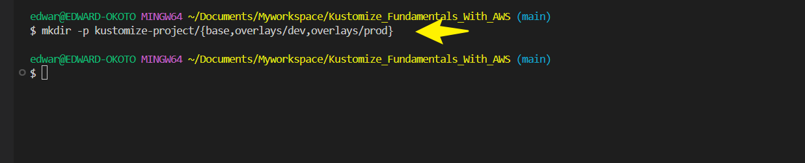
✔ Creates directories for the base configuration and environment-specific overlays.

---

#### **Step 2: Define the Base Kubernetes Manifest**
Inside `kustomize-project/base/`, create a **Deployment** file (`deployment.yaml`):

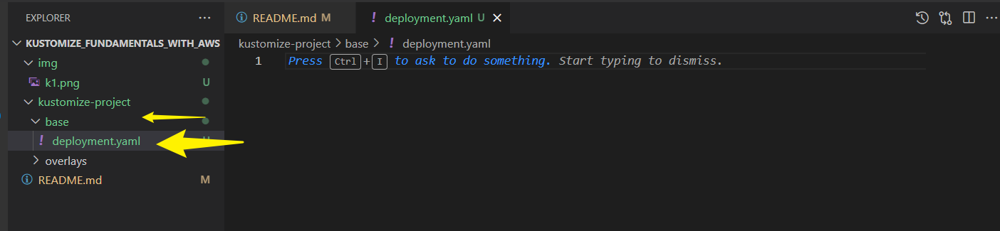

```yaml
   apiVersion: apps/v1    # API version for the deployment object
   kind: Deployment       # Specifies that this is a Deployment
   metadata:
      name: nginx-deployment  # Name of the deployment
   spec:                   # Specification of the deployment
      replicas: 2           # Number of replicas (pods running)
      selector:             # Selector to identify the pods
        matchLabels:
           app: nginx
      template:             # Template for the pod creation
        metadata:
        labels:
           app: nginx     # Label applied to the pod
        spec:
        containers:      
        - name: nginx    # Name of the container
           image: nginx:1.14.2  # Docker image to use for the container
           ports:
           - containerPort: 80  # Port the container will expose
```
---


#### **Step 3: Create a Service file**
Inside `kustomize-project/base/`, create a **Service** file (`service.yaml`):

```yaml
apiVersion: v1
kind: Service
metadata:
  name: webapp-service
spec:
  selector:
    app: webapp
  ports:
    - protocol: TCP
      port: 80
      targetPort: 80
  type: LoadBalancer
  ```


#### **Step 4: Define the Kustomization File (`kustomization.yaml`)**
Inside `kustomize-project/base/`, create a `kustomization.yaml` file:

```yaml
resources:
  - deployment.yaml
  - service.yaml
```

---

#### **Step 4: Create Environment-Specific Overlays**
Modify configurations for **dev** and **prod** environments.

 Dev Overlay (`overlays/dev/kustomization.yaml`)
```yaml
bases:
  - ../../base # Path to the base configuration directory
patchesStrategicMerge:
  - replica_count.yaml # List of patches to apply to the base resources
```

Create `overlays/dev/replica_count.yaml` to override replicas:

```yaml
apiVersion: apps/v1 # API version for the deployment object
kind: Deployment # Specifies that this is a Deployment
metadata:
  name: nginx-deployment # Name of the deployment to patch
spec:
  replicas: 3  # Updating the number of replicas for the dev environment

```

✔ This increases replicas to **3** for the dev environment.

##### Prod Overlay (`overlays/prod/kustomization.yaml`)
```yaml
namespace: webapp-prod
bases:
  - ../../base

patchesStrategicMerge:
  - patch-deployment.yaml
commonLabels:
  env: prod
```

Create `overlays/prod/patch-deployment.yaml` to increase replicas:

```yaml
apiVersion: apps/v1
kind: Deployment
metadata:
  name: webapp
spec:
  replicas: 4
```

✔ This scales the web app to **4 replicas** in production.

---
### kustomize allows the use of variables and placeholders for dynamic configuration values

Kustomize enhances **dynamic configuration management** by enabling **variable substitution** and **placeholders**, making it easier to tailor Kubernetes manifests for different environments without modifying the base files.

---

#### ✅ **How Kustomize Uses Variables & Placeholders**
Kustomize allows dynamic values using **`vars` (variables)** and **`configMapGenerator` or `secretGenerator`** to inject runtime configurations.

1️⃣ **Variable Substitution (`vars`)**  
   - Defines placeholders that reference values from other Kubernetes resources.  
   - Helps maintain consistency across different manifests.  

2️⃣ **ConfigMaps & Secrets (`configMapGenerator`, `secretGenerator`)**  
   - Generates **configuration data or secrets dynamically** and injects them into workloads.  
   - Prevents hardcoding sensitive values inside deployment files.

---

#### ✅ **Example: Using Variables in Kustomize**
##### **1. Define a ConfigMap in `base/configmap.yaml`**
```yaml
apiVersion: v1
kind: ConfigMap
metadata:
  name: app-config
data:
  ENVIRONMENT: "production"
```

#####  **2. Reference the Variable in `kustomization.yaml`**
```yaml
resources:
  - configmap.yaml
  - deployment.yaml

vars:
  - name: ENVIRONMENT
    objref:
      kind: ConfigMap
      name: app-config
      apiVersion: v1
    fieldref:
      fieldpath: data.ENVIRONMENT
```
✔ **`vars`** dynamically injects values from `ConfigMap` into other manifests.

#####  **3. Apply Variables in `deployment.yaml`**
```yaml
apiVersion: apps/v1
kind: Deployment
metadata:
  name: webapp
spec:
  template:
    spec:
      containers:
        - name: webapp
          image: nginx
          env:
            - name: ENVIRONMENT
              value: "$(ENVIRONMENT)"
```
✔ The **`$(ENVIRONMENT)` placeholder** is replaced with values from the `ConfigMap`.

---

##### ✅ **Advanced Placeholder Techniques**
1️⃣ **Generating ConfigMaps & Secrets**  
```yaml
configMapGenerator:
  - name: dynamic-config
    literals:
      - API_KEY=123456
```
✔ Prevents **manual configuration** errors.

2️⃣ **Using Overlays for Environment-Specific Values**  
```yaml
patchesStrategicMerge:
  - patch-deployment.yaml
```
✔ Adjusts configurations **without modifying the base YAML files**.

---

## Leveraging AWS: Using Amazon EKS for kustomize
 
#### Step 1 ✅ **Set up your AWS Account and CLI**
**1. Create an AWS account** : if you dont already have an AWS Account,create one at [AWS management Console](https://aws.amazon.com/console/)

**1. Install AWS CLI** : 
- Download and install the AWS CLI from the [official guide](https://aws.amazon.com/cli/)
- Configure the CLI with your credentials.Run `aws configure` and enter your AWS Access key ID, Secret Access Key, and default region.

Run below command to check your configured profile

```
aws configure list-profiles
```

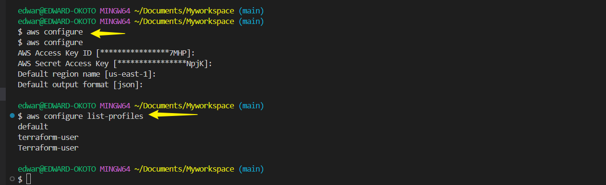


**2. Install and Configure `eksctl`** :

`eksctl` is a simple CLI tool for creating clusters on EKS.Its the easiest way to get started with Amazon EKS.

Install `eksctl` : Follow the installation instructions on the [eksctl Github Repository](https://github.com/eksctl-io/eksctl)

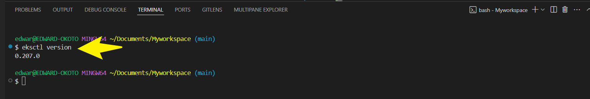

No specific configuration is required post-installation.It works with your AWS CLI configuration.


### Create an EKS Cluster

1. **Create a Cluster**

- Run the following command to create a cluster(this can take several minutes)

```
eksctl create cluster --name my-kustomize-cluster --version 1.18 --region us-east-1 --nodegroup-name my-nodes --node-type t2.medium --nodes 3
```
- This command creates an EKS cluster named `my-kustomize-cluster` with `3` nodes of type `t2.medium`

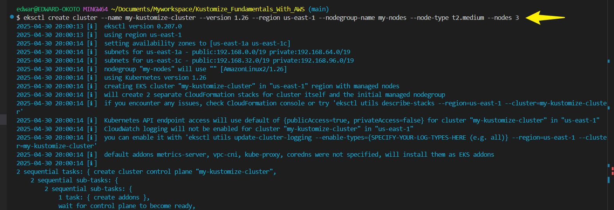

2. **Verify Cluster Creation**

- Once the creation is complete, verify your cluster with `kubectl get svc`

 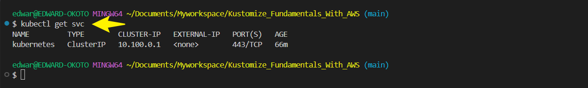

 ### Deploying Kustomize Configurations to EKS

 1. **Prepare Your Kustomize Configuration**

- Ensure you customize configuration is ready in your project directory.

2. **Apply Configurations to EKS**

- Select the appropraite overlay for your environment. For example,if you are working on the development environment, you would chose the `dev` overlay.

-Run the following command from the root of your project directory.

###### Deploy Dev Environment
```sh
kubectl apply -k overlays/dev/
```
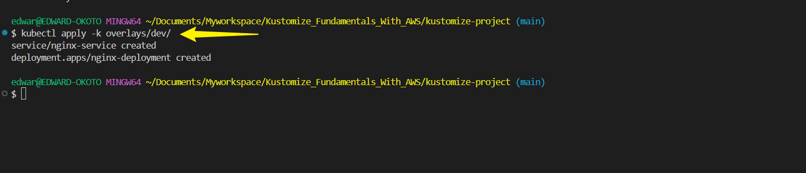

###### Deploy Prod Environment
```sh
kubectl apply -k overlays/prod/
```

✔ Kubernetes will **deploy the application** using environment-specific configurations.


### Verify Deployment 

1. **Check deployed resources** 

- Run `kubectl get all` to see all resources like services,deployment,pods, that have been deployed in the cluster.

```sh
kubectl get all
```
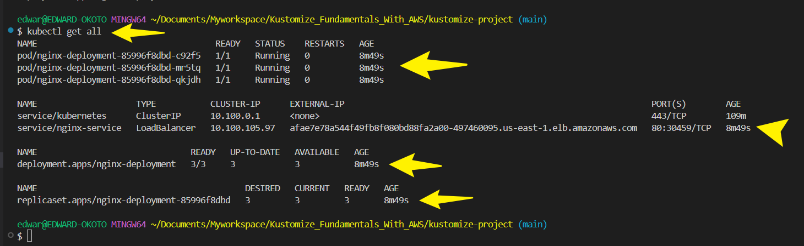

2. **Troubleshoot if needed.Use `kubectl describe` or `kubectl logs` commands to troubleshoot

### Clean Up Resources

1. **Delete Deployed Resources** 

- When done testing,clean up resources to avoid incurring cost on AWS.
- Run command below to remove all the resources

```sh
kubectl delete -k overlays/dev/
```

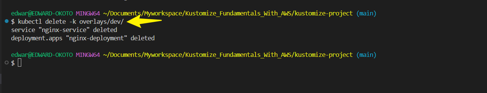

1. **Delete the EKS Cluster** 

- Remove your EKS cluster

```sh
eksctl delete cluster --name my-kustomize-cluster
```
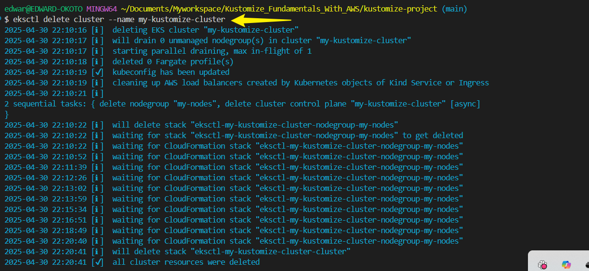


# Advanced Kustomize Features

## Working With Overlays

Objective: Master the use of overlays in kustomize for different environmental Configurations.

Detailed Steps:

**Creating Environmental Specific Directories**

- Create sub-directories for your `overlays` directory for the different environment you want to work in.

- Run `mkdir -p overlays/{dev,staging,prod}`

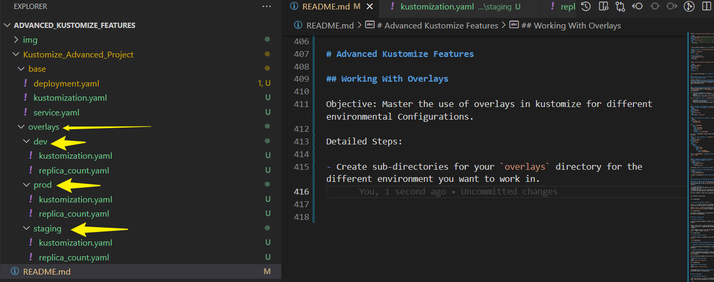

**Setting Up Environment Configurations**

- Each environment will have its own `kustomization.yaml` to specify unique customizations.

- Inside `overlays/dev/kustomization.yaml` specify development specific settings.

```yaml
apiVersion: kustomize.config.k8s.io/v1beta1
kind: Kustomization
resources:
- ../../base
patchesStrategicMerge:
  - replica_count.yaml
```
`replica_count.yaml` can be used to alter the number of replicas in the development environment.

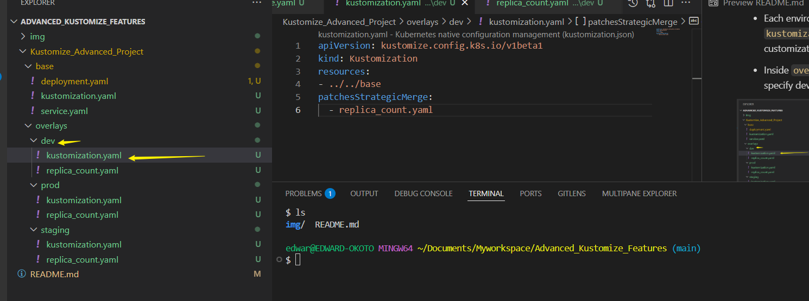


**Applying Overlays for Each Environmnent**

- Use Kustomize to apply configurations for a specific environment.
- Command : `kubectl apply -k overlays/dev` to deploy the development configuration.

## Transformers and Generators

Objectives: Learn to use transformers and generators for resource customization.

Detailed Steps:

**Customizing Labels For Production Environment**

- In `overlays/dev/kustomization.yaml` use `commonLabels` to add labels to all resources for easy identification.

```
# overlays/prod/kustomization.yaml
commonLabels:
  env: production  # Label applied to every resource
```

**Implementing Name Prefix**
- Adding a prefix to resource names helps to dintinguish resources accross different environment.

```
namePrefix: prod-  # Prefix added to the name of all resources
```
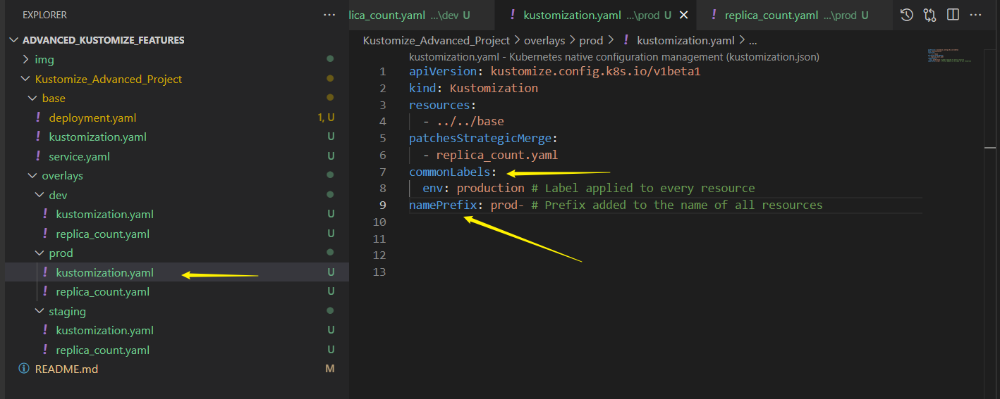


## Secrets and ConfigMaps Management.

Objectives: Effectively Manage Configuration Data and Secrets

Detailed Steps:

**Generating a ConfigMap**

- In the base `kustomization.yaml` use `configMapGenerator` to create a configMap from literal values.

```
# base/kustomization.yaml
configMapGenerator:
- name: my-configmap  # Name of the ConfigMap
  literals:
  - key1=value1       # Key-value pairs
  - key2=value2

```

**Creating Secrets Safely**
- Use `secretGenerator` to generate Secrets. Ensure sensitive data like passwords are encoded or externally managed.

```
# base/kustomization.yaml
secretGenerator:
- name: my-secret     # Name of the Secret
  literals:
  - username=admin    # Key-value pairs; consider external management for real secrets
  - password=s3cr3t
```

NB: Always use secure method to inject these values. For this project,we will make use of environmental variables.

In **Kustomize**, you can use **environment variables** to dynamically generate **Secrets** using `secretGenerator`. This allows for secure and flexible management of sensitive values.  

---

###### ✅ **Step 1: Define a Secret Generator in `kustomization.yaml`**
Modify your **`kustomization.yaml`** to include a **`secretGenerator`**:

```yaml
apiVersion: kustomize.config.k8s.io/v1beta1
kind: Kustomization
secretGenerator:
  - name: my-ConfigMap
    envs:
      - config.env  # Reference an environment file

```

✔ This tells Kustomize to generate a **Secret** using environment variables stored in `config.env`.

---

###### ✅ **Step 2: Create Your Environment Variables File**
Inside the **`config.env`** file, define your secrets:
You can define the environmental variables at the `base` or at the `overlays ` for different environment.

```
key1=value1
key2=value2
username=admin
password=s3cr3t
```

✔ Kustomize **reads this file** and injects its contents as key-value pairs into the Kubernetes Secret.

---

###### ✅ **Step 3: Apply the Kustomization**
Run:
```sh
kubectl apply -k .
```
✔ This will create a **Secret** with the values from `config.env`.  

---

### **Best Practices**
✔ **Never commit `config.env` to Git** – Keep sensitive values out of version control.  
✔ **Use a `.gitignore` rule for `config.env`**:  
```
config.env
```


################################################################################################
################################################################################################
################################################################################################

# Advanced Configuration Management With Kustomize and AWS.

### Integrating Kustomize into CI/CD Pipelines

Objective : Automating Kubernetes configuration management using Kustomize integrated into Github Actions CI/CD workflows

#### Set Up GitHub Actions

##### GitHub Repository:
- Ensure you have a github repository for your kubernetes project with kustomize configurations.

##### **Step 1: Set Up Kustomize for your web-application Deployment**
Organize your directory structure properly:
```
.github/workflows/    # GitHub Actions CI/CD process
kustomize-nginx/
  ├── base/           # Common NGINX setup
  │   ├── deployment.yaml
  │   ├── service.yaml
  │   ├── configmap.yaml
  │   ├── kustomization.yaml
  ├── overlays/
  │   ├── dev/        # Development-specific customizations
  │   │   ├── kustomization.yaml
  │   │   ├── patches.yaml
  │   │   ├── secrets.yaml
  │   ├── prod/       # Production-specific customizations
  │       ├── kustomization.yaml
  │       ├── patches.yaml
  │       ├── secrets.yaml
```
✔ **Base directory** contains common configurations.  
✔ **Overlays directory** allows environment-specific modifications.  
✔ **GitHub Actions workflows** automate deployments.

---

###### **Step 2: Define the Base Configuration**
Inside `base/`, create the essential Kubernetes manifests.

#### **Deployment (`base/deployment.yaml`)**
```yaml
apiVersion: apps/v1  # API version for the deployment object
kind: Deployment      # Specifies that this is a Deployment
metadata:
  name: nginx         # Name of the deployment
spec:                    # Specification of the deployment
  replicas: 2            # Number of replicas (pods running)
  selector:              # Selector to identify the pods
    matchLabels:
      app: nginx
  template:              # Template for pod creation
    metadata:
      labels:
        app: nginx       # Label applied to the pod
    spec:
      containers:
      - name: nginx      # Name of the container
        image: nginx:stable  # Updated to stable NGINX version
        ports:
          - containerPort: 80  # Port the container will expose
        resources:
            requests:
              memory: "128Mi"
              cpu: "250m"
            limits:
              memory: "512Mi"
              cpu: "1000m"
        envFrom:                   # Dynamically load environment variables
          - configMapRef:
              name: nginx-config
          - secretRef:
              name: nginx-secret
        livenessProbe:              # Ensures container is running
          httpGet:
            path: /
            port: 80
          initialDelaySeconds: 3
          periodSeconds: 10
        readinessProbe:             # Ensures container is ready to serve traffic
          httpGet:
            path: /
            port: 80
          initialDelaySeconds: 5
          periodSeconds: 10
```


✔ Deploys **NGINX** with two replicas for redundancy.


#### **Service (`base/service.yaml`)**
```yaml
apiVersion: v1
kind: Service
metadata:
  name: nginx-service
spec:
  selector:
    app: nginx
  ports:
    - protocol: TCP
      port: 80
      targetPort: 80
  type: LoadBalancer
```
✔ Exposes NGINX as a **load-balanced service**.

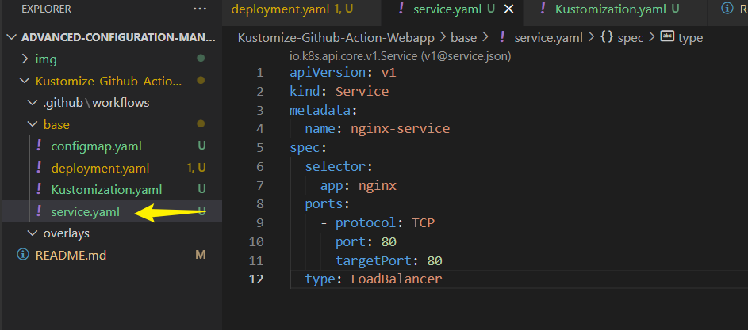

#### **Base `kustomization.yaml`**
```yaml
apiVersion: kustomize.config.k8s.io/v1beta1
kind: Kustomization
resources:
  - deployment.yaml
  - service.yaml
namePrefix: base-
commonLabels:
  app: nginx
```
✔ Defines common **NGINX resources**.

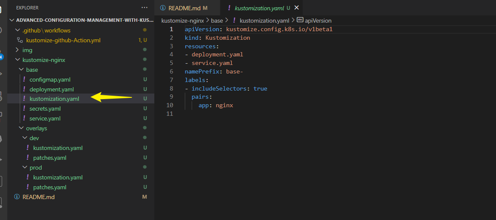

---

##### **Step 3: Create Overlays for Multi-Environment Customizations**
Inside `overlays/dev/`, define environment-specific modifications.

##### **Development Overlay (`overlays/dev/kustomization.yaml`)**
```yaml
apiVersion: kustomize.config.k8s.io/v1beta1
kind: Kustomization
resources:
  - ../../base
patches:
  - patches.yaml
```
✔ Dynamically **adjusts configuration** for development.

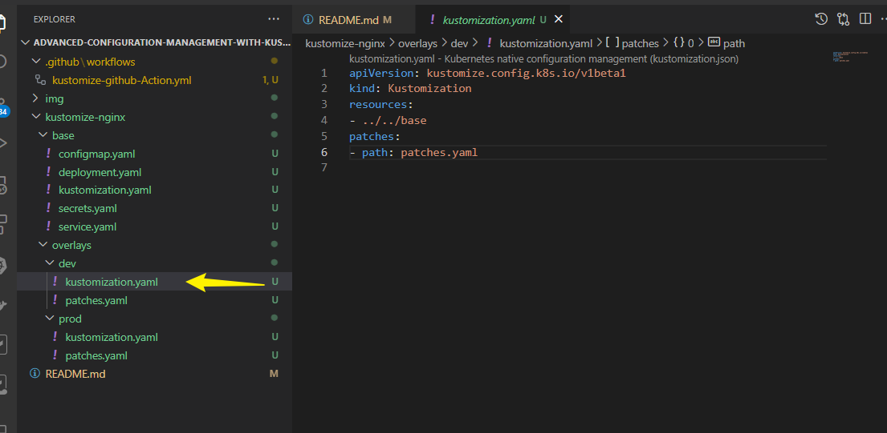

#### **Patch Example (`overlays/dev/patches.yaml`)**
```yaml
apiVersion: apps/v1
kind: Deployment
metadata:
  name: nginx
spec:
  replicas: 3
  selector:
    matchLabels:
      app: nginx
  template:
    metadata:
      labels:
        app: nginx
```
✔ **Increases replica count** for scaling in development.

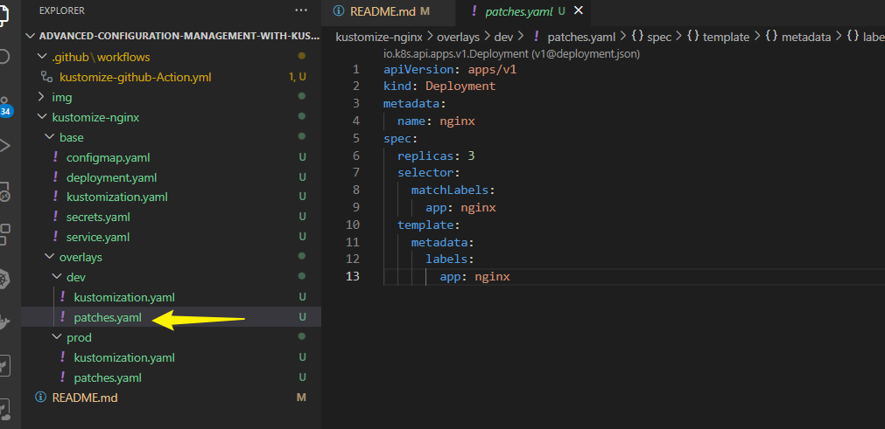

Similar setup applies for **production** in `overlays/prod/`.

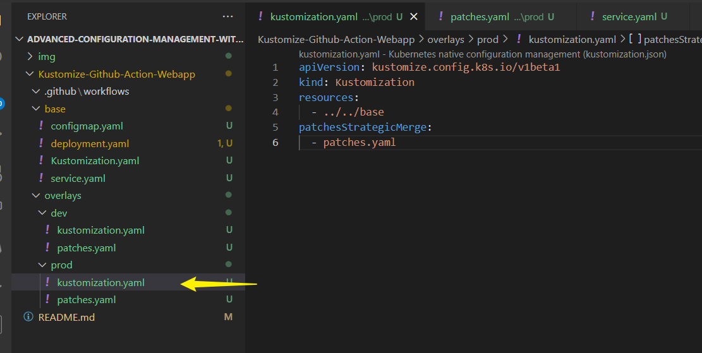
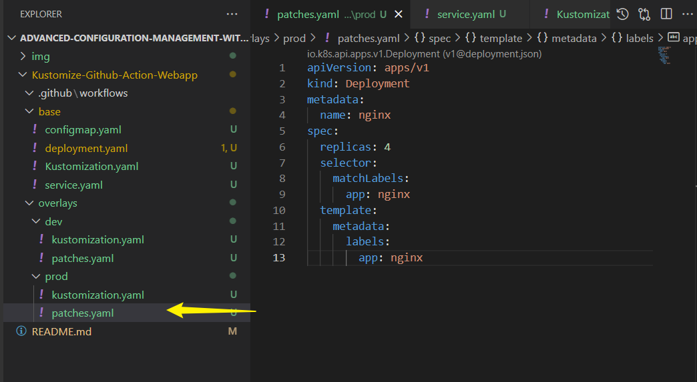

---

##### **Step 4: Automate Deployment with GitHub Actions**
Define a workflow **`.github/workflows/kustomize-deploy.yml`** to automate CI/CD.

#### **GitHub Actions Workflow**
```yaml
name: Deploy with Kustomize
on:
  push:
    branches:
    - main

jobs:
  deploy:
    runs-on: ubuntu-latest
    steps:
      - name: Checkout Repository
        uses: actions/checkout@v3

      - name: Set Up Kubectl & Kustomize
        run: |
          curl -LO "https://dl.k8s.io/release/$(curl -L -s https://dl.k8s.io/release/stable.txt)/bin/linux/amd64/kubectl"
          chmod +x kubectl && mv kubectl /usr/local/bin/
          curl -s "https://api.github.com/repos/kubernetes-sigs/kustomize/releases/latest" | jq -r '.assets[] | select(.name | endswith("linux_amd64.tar.gz")) | .browser_download_url' | xargs curl -L -o kustomize.tar.gz
          tar -xzf kustomize.tar.gz && chmod +x kustomize && mv kustomize /usr/local/bin/

      - name: Set Kubernetes Context
        run: |
          echo "${{ secrets.KUBE_CONFIG }}" > kubeconfig.yaml
          export KUBECONFIG=kubeconfig.yaml

      - name: Apply Kustomize Overlay
        run: |
          kubectl apply -k overlays/dev/
```
✔ Ensures **GitHub Actions triggers deployments**.  
✔ Uses **GitHub Secrets** to securely store Kubernetes credentials.

---

#### ✅ **Step 5: Deploy To Amazon EKS via GitHub Actions**

You can use **GitHub Actions** as your **CI/CD tool** to automate the creation of an **Amazon EKS cluster**! This ensures that every time a change is pushed to your infrastructure repository, your cluster is provisioned or updated automatically.

---

##### ✅ **Step 1: Store AWS Credentials in GitHub Secrets**
You’ll need AWS credentials to create an EKS cluster:
1️⃣ Go to **GitHub Repository → Settings → Secrets & Variables → Actions**  
2️⃣ Add the following secrets:
   - `AWS_ACCESS_KEY_ID`
   - `AWS_SECRET_ACCESS_KEY`
   - `AWS_REGION` (e.g., `us-east-1`)

   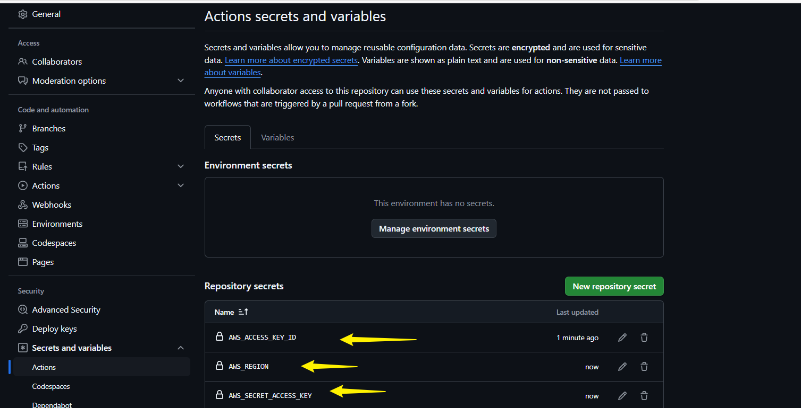
---

##### ✅ **Step 2: Define Your Infrastructure Code**
Create a new directory for **EKS infrastructure management**:
```
infra/
  ├── eks-cluster.yaml
  ├── kustomize-nginx/
  ├── .github/workflows/deploy-eks.yml
```

Inside `infra/eks-cluster.yaml`, define your **EKS cluster setup using eksctl**:
```yaml
apiVersion: eksctl.io/v1alpha5
kind: ClusterConfig

metadata:
  name: nginx-cluster
  region: us-east-1

nodeGroups:
  - name: workers
    instanceType: t3.medium
    desiredCapacity: 2
    minSize: 2
    maxSize: 4
```
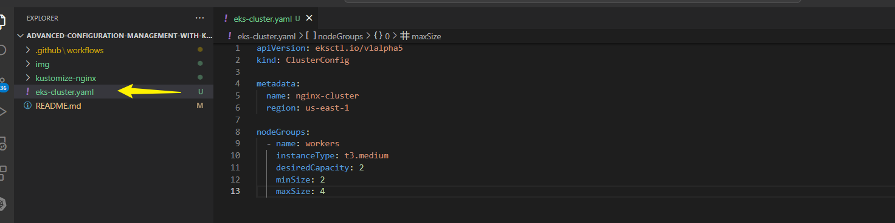
---

##### ✅ **Step 3: Create GitHub Actions Workflow to Provision EKS**
Update CI/CD automation inside `.github/workflows/kustomize-github-action.yml`:

```yaml
name: Deploy with Kustomize & EKS

on:
  push:
    branches:
      - main

jobs:
  deploy:
    runs-on: ubuntu-latest
    permissions:
      id-token: write
      contents: read

    steps:
      - name: Checkout Repository
        uses: actions/checkout@v3

      - name: Configure AWS Credentials
        uses: aws-actions/configure-aws-credentials@v2
        with:
          aws-access-key-id: ${{ secrets.AWS_ACCESS_KEY_ID }}
          aws-secret-access-key: ${{ secrets.AWS_SECRET_ACCESS_KEY }}
          aws-region: ${{ secrets.AWS_REGION }}

      - name: Install eksctl
        run: |
          curl --silent --location "https://github.com/weaveworks/eksctl/releases/latest/download/eksctl_Linux_amd64.tar.gz" | tar xz -C /usr/local/bin

      - name: Create EKS Cluster
        run: |
          eksctl create cluster --name nginx-cluster --region ${{ secrets.AWS_REGION }} --nodegroup-name workers --nodes 2 --managed

      - name: Update Kubeconfig
        run: |
          aws eks --region ${{ secrets.AWS_REGION }} update-kubeconfig --name nginx-cluster

      - name: Cache Docker layers
        uses: actions/cache@v2
        with:
          path: /tmp/.buildx-cache
          key: ${{ runner.os }}-buildx-${{ github.sha }}
          restore-keys: |
            ${{ runner.os }}-buildx-

      - name: Log in to Docker Hub
        run: |
          echo "${{ secrets.DOCKER_TOKEN }}" | docker login -u "${{ secrets.DOCKER_USERNAME }}" --password-stdin

      - name: Build and Push Docker Image to Docker Hub
        run: |
          docker buildx create --use
          docker buildx build --push --tag edwardokoto1/nginx:latest \
            --cache-from=type=local,src=/tmp/.buildx-cache \
            --cache-to=type=local,dest=/tmp/.buildx-cache .

      - name: Install Kubectl & Kustomize (Fixed Kubectl Download)
        run: |
          curl -LO "https://dl.k8s.io/release/$(curl -L -s https://dl.k8s.io/release/stable.txt)/bin/linux/amd64/kubectl"
          chmod +x kubectl && mv kubectl /usr/local/bin/
          curl -LO "https://github.com/kubernetes-sigs/kustomize/releases/latest/download/kustomize_linux_amd64.tar.gz"
          tar -xzf kustomize_linux_amd64.tar.gz && chmod +x kustomize && mv kustomize /usr/local/bin/

      - name: Apply Kustomize Overlay
        run: |
          kubectl apply -k overlays/dev/
```

---

##### ✅ **Step 4: Push Changes to Trigger CI/CD**
Commit your workflow:
```sh
git add .
git commit -m "Automate EKS provisioning with GitHub Actions"
git push origin main
```
✔ **This will automatically trigger the workflow**, provisioning the EKS cluster!

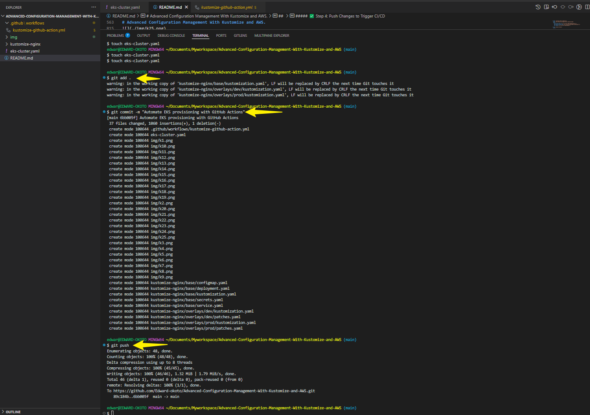
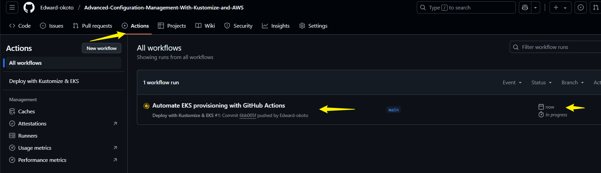

---


